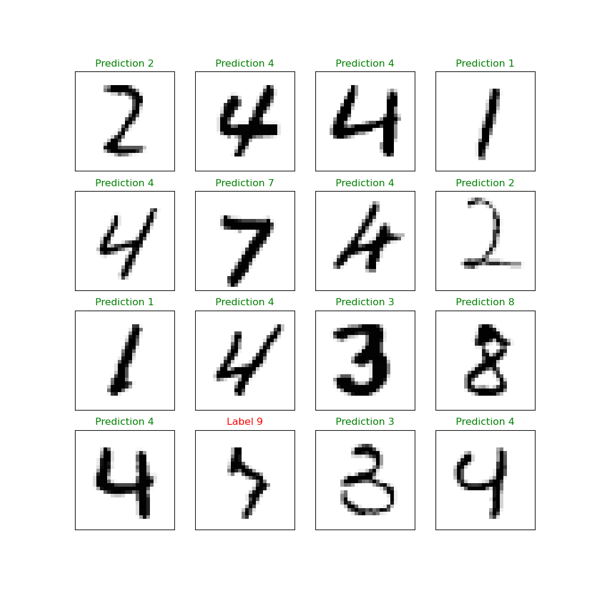

This project is: <b>COMPLETE</b> 
This is part of the PORTFOLIO project - A list of projects designed to showcase various skills I love to learn. Projects include:

- [Regression techniques from scratch](https://github.com/jrobo-gith/Regression-techniques-from-scratch)
- [Building a neural network from scratch](https://github.com/jrobo-gith/NN-from-scratch)
- [Building CNN using Pytorch](https://github.com/jrobo-gith/MNIST-CNN)

# MNIST-CNN
Uses a convolutional neural network to predict numbers from MNIST dataset. This project makes use of a high level neural network package called Pytorch, making this project more of an investigation into the power of a CNN. Another project in my github called ___ involves building a neural network from scratch which dives deeper into the structure of a standard NN.

### Details
This is a simple use case of a convolutional neural network, used to predict numbers from the MNIST dataset - a famous dataset used for training NNs such as these. The CNN was shown 60,000 training images of black backgrounds with white numbers of size 28x28. I managed to achieve a mean accuracy of 97.5% when testing the model on 10,000 images.

##### Packages
* Pytorch
* Numpy
* Matplotlib

#### CNN Structure
The CNN consists of three layers of convolutional filters, three layers of activation functions and three max pooling layers, arranged as:
* Conv2d
* Activation Layer
* Max Pooling

One could argue that having too many convolutional layers could result in overfitting, vanishing or exploding gradients, especially because of the simplicity of the images, however the accuracy remained to a high standard despite the number of layers. Investigations into the accuracy of a model utilising less layers could be made in the future. 

#### CNN Training
To train the CNN, the training data was loaded onto a pytorch dataloader with a batch size of 100. Increasing the batch size is feasible due to the size of the image, as arrays of 100x28x28 will fit easily onto 8GB RAM. Moreover, it will increase the convergence rate of the model, as more data is being used to calculate the gradient and update the weights through backpropagation.
We loop through the data for 10 epochs, allowing the model to refine its weights whilst remaining reasonably generalisable. Conversly, this dataset will not have many deviations in detail from the training data. A number is a number and cannot have massive errors that the model will have to generalise to identify the number, therefore the chance of reduced accuracy due to overfitting is mitigated. Perhaps on a different dataset I would be more worried about overfitting. 
The batch was loaded onto the optimal device (CPU or GPU if valid CUDA GPU present), predictions from the model were made and fed into the loss function, as we are classifying, the Cross Entropy Loss was chosen. Using results calculated from the loss function, the weights are updated through backpropagation. 

#### CNN Testing
The testing data was loaded on a pytorch dataloader, as before, a batch was loaded onto the optimum device, and the labels were predicted. The predicted labels were compared to the true labels, giving either a True for a correct answer, or False for an incorrect answer. The number of correct answers was compared with the total number of labels, yielding a mean accuracy of 97.5%. Below is a random sample of 16 images to showcase the CNNs performance

As seen above, the model predicts each label with excellent accuracy, occasionally (understandibly) mistaking some numbers for others, however these numbers are hard even for a person to distinguish. Although, this does raise some potential questions regarding overfitting as mentioned earlier.

#### Further Investigation
* As mentioned above, we could play around with the structure of the CNN, the learning rate, the choice of loss function etc.

